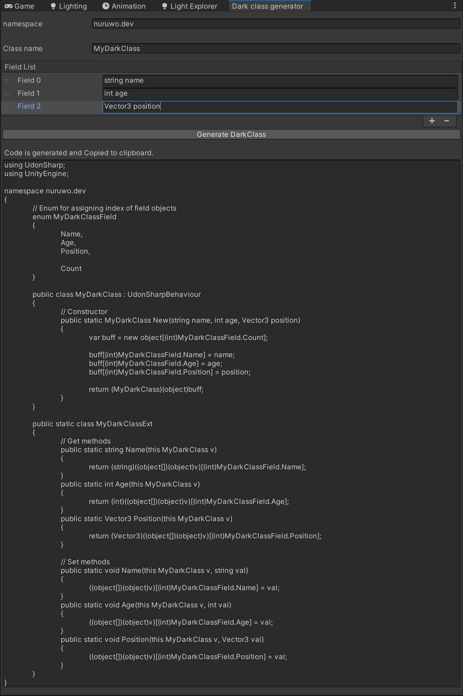
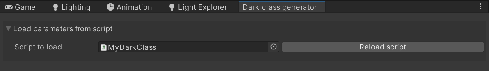
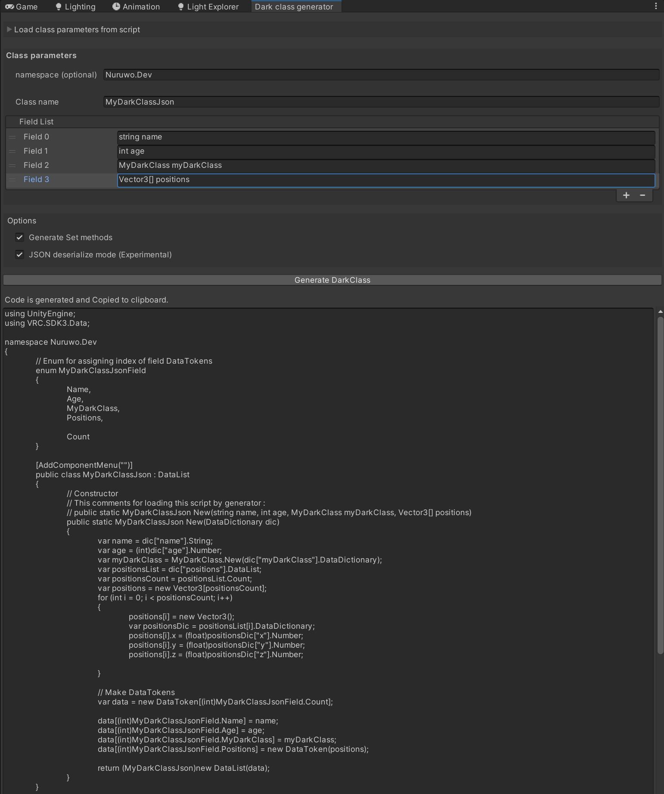

# DarkClass generator for VRChat
DarkClass is to make your custom UdonSharp class

## Generate your DarkClass
You can call up this tool by clicking <Tools/Nuruwo/DarkClassGenerator> in the Editor menu.
As shown in the image, enter these items and press the button to generate the code.

<kbd></kbd><br><br>

## Usage generated DarkClass in your UdonSharp scripts
Generated class can be used in other UdonSharp scripts as follows.

```cs
using UdonSharp;
using UnityEngine;

namespace Nuruwo.Dev
{
    public class DarkClassTest : UdonSharpBehaviour
    {
        void Start()
        {
            //Instantiate
            var myDarkClass = MyDarkClass.New("Jane Doe", 23, new Vector3(0.5f, 0.4f, 0.9f));

            //Get
            Debug.Log(myDarkClass.Name());      //"Jane Doe"
            Debug.Log(myDarkClass.Age());       //23
            Debug.Log(myDarkClass.Position());  //(0.50, 0.40, 0.90)

            //Set
            myDarkClass.Name("Strong Power");
            Debug.Log(myDarkClass.Name());      //"Strong Power"
        }
    }
}
```

## Load parameters from a DarkClass script file
Open the fold as shown in the image and specify a DarkClass script to extract each parameter.

<kbd></kbd><br><br>

## JSON deserialize mode
When optionally turned on, it generates the following code. Array and DarkClass nesting is also possible.

<kbd></kbd><br><br>

# Update
In V2.0. Improved to DataList version.This was inspired by this code. Thanks 
TheHelpfulHelper!</br>
https://gist.github.com/TheHelpfulHelper/e94c44764e1bf9e73d24e52f2983431d


## Reference
See detail technical article</br>
https://power-of-tech.hatenablog.com/entry/2024/06/12/191828